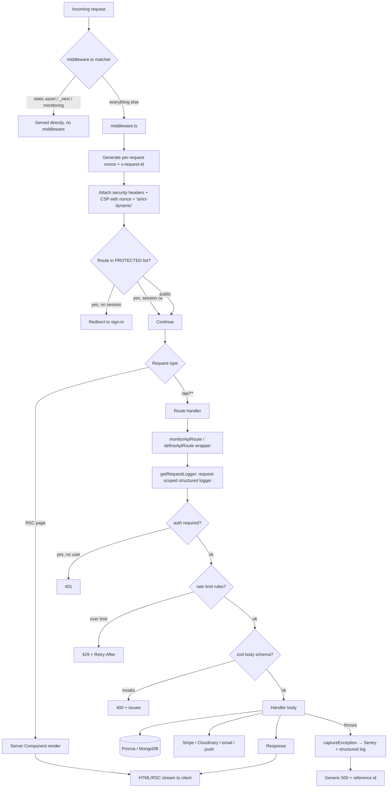
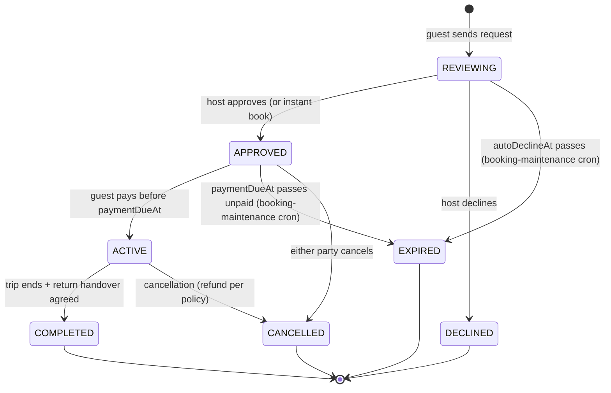
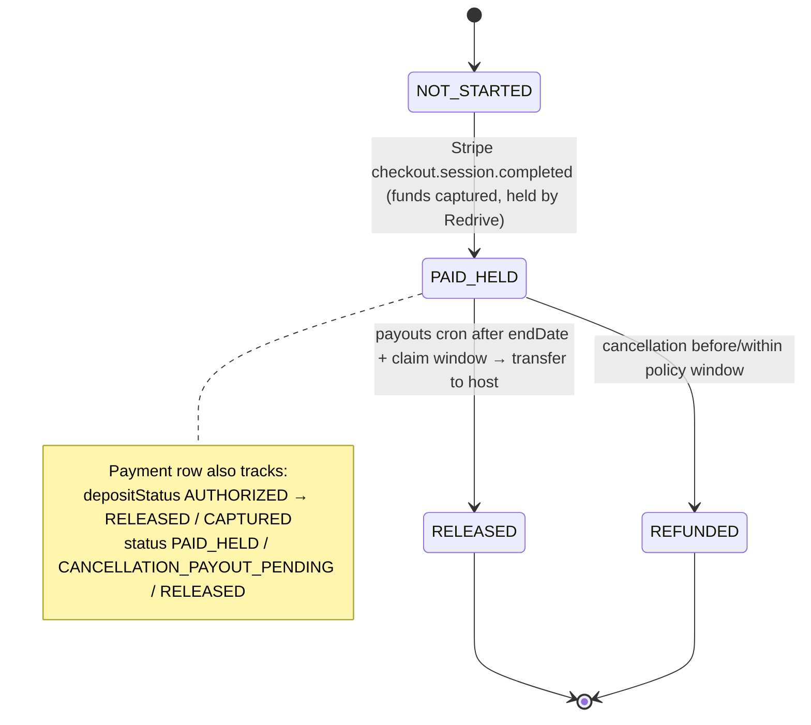

# Redrive architecture

A peer-to-peer vehicle-hire marketplace. Next.js 15 (App Router) + React 19 on
Vercel, MongoDB via Prisma, Stripe for payments, Cloudinary for images, and a
React Native (Expo) mobile app that talks to the same backend under
`/api/mobile/v1`.

- **Web app & API**: `app/` (App Router routes + `app/api/**/route.ts`)
- **Legacy Pages API**: `pages/api/auth/[...nextauth].ts` (NextAuth only)
- **Shared request/response schemas**: `packages/contracts` (`@redrive/contracts`, `@redrive/contracts/mobile`, `@redrive/contracts/web`)
- **Mobile app**: `apps/mobile`
- **Design tokens**: `packages/design-tokens`

---

## 1. Request lifecycle

Every request passes through `middleware.ts` first, then either a page (RSC) or
an API route handler. API routes are wrapped by `monitorApiRoute` /
`defineApiRoute` for a consistent preamble.

### Cross-cutting infrastructure

| Concern | Where | Notes |
| --- | --- | --- |
| Auth (web) | `pages/api/auth/[...nextauth].ts` | NextAuth JWT sessions; credentials + Google. Durable session rows via `webSessions.ts`, idle timeout in `sessionPolicy.ts`. |
| Auth (mobile) | `app/libs/mobile-auth/**` | Opaque access + refresh tokens, rotating token families, `MobileSession` rows. |
| Credential check | `app/libs/credentialCheck.ts` | Single constant-time email+password check shared by web NextAuth, `/api/auth/login`, and mobile login. |
| Rate limiting | `app/libs/security.ts` + `app/libs/rateLimitStore.ts` | Upstash Redis fixed-window when `UPSTASH_*` set, else Mongo `RateLimitBucket`. Fails open. |
| Structured logging | `app/libs/logger.ts` | Zero-dep JSON lines in prod, request correlation ids. |
| Error tracking | `app/libs/observability.ts` → `@sentry/nextjs` | No-op unless `SENTRY_DSN` / `NEXT_PUBLIC_SENTRY_DSN` set. `instrumentation.ts` + `app/error.tsx` + `app/global-error.tsx`. |
| Env validation | `app/libs/env.ts` | `validateServerEnv()` runs in `instrumentation.register()`; throws in production if core vars are missing. |
| CSP / security headers | `middleware.ts` | Per-request nonce, `'strict-dynamic'`, tight `connect-src` (Pusher, Vercel, self). |
| Realtime | `app/libs/realtime/**` + `app/hooks/useLiveUpdates.ts` | Pusher private channels when configured, SSE fallback otherwise. |
| Booking concurrency | `app/libs/bookingLock.ts` | `BookingLock.listingId @unique` advisory lock around conflict-check + create. |
| Idempotency | `app/libs/stripeWebhookEvents.ts`, `IdempotencyRecord` | Claim-first dedupe for Stripe webhooks and mobile writes. |
| Audit trail | `app/libs/security.ts` `writeAuditEvent` | Security-relevant actions (`CRITICAL_AUDIT_PREFIXES`) escalate a failed write to Sentry. |

---

## 2. Booking & payment state machine

Two statuses live on `Reservation`: `status` (the booking) and `paymentStatus`
(the money). A related `Payment` row tracks Stripe + payout state.

Key time gates on `Reservation`: `autoDeclineAt`, `paymentDueAt`,
`confirmedAt`/`paidAt`, `returnHandoverAgreedAt`, `claimWindowEndsAt`,
`autoReleaseAt`. The Stripe webhook (`app/api/stripe/webhook/route.ts`) is the
only writer that moves `paymentStatus` to `PAID_HELD`; the payouts cron is the
only writer that moves it to `RELEASED`.

---

## 3. Cron catalogue

Scheduled by `vercel.json`; each endpoint requires `Authorization: Bearer $CRON_SECRET`
and is wrapped in `withCronLock(name, fn)` (`CronRun.name @unique` advisory lock,
stale after 10 min) so overlapping invocations skip rather than double-run.
Success/failure is reported to Sentry via `captureCheckIn`.

| Path | Schedule (UTC) | Lock name | What it does |
| --- | --- | --- | --- |
| `/api/cron/notifications` | `0 * * * *` (hourly) | `cron-notifications` | Expire old notifications; `runLifecycleSweep` (booking lifecycle reminders/transitions); saved-search match alerts. |
| `/api/cron/booking-maintenance` | `0 * * * *` (hourly) | `cron-booking-maintenance` | Expire `APPROVED` reservations past `paymentDueAt` (and expire their Stripe checkout session); `syncDueCalendars` (external iCal import). |
| `/api/cron/payouts` | `30 1 * * *` (daily) | `cron-payouts` | Release held payments (`PAID_HELD` past `endDate`, or `CANCELLATION_PAYOUT_PENDING` past due) to hosts via `releaseReservationPayment`. |
| `/api/cron/security-maintenance` | `15 2 * * *` (daily) | `cron-security-maintenance` | Delete expired password-reset tokens, web/mobile sessions, auth challenges, licence checks; prune disabled/stale `MobilePushToken`s (90d); expire stale licence verifications. TTL indexes (`scripts/create-ttl-indexes.mjs`) do the bulk expiry; this is the retention-window backstop. |

Manual trigger: `POST` with the same bearer token (where supported), or
`Actions → run workflow` for the maintenance workflows.

---

## 4. Data model notes

- **No migrations** — MongoDB via `prisma db push`. New `@unique` / `@@index`
  must be pushed to exist. TTL (`expireAfterSeconds`) is not schema-expressible;
  `scripts/create-ttl-indexes.mjs` applies it via `collMod`.
- **Denormalized read fields**, kept fresh by write-time helpers in
  `app/libs/listingStats.ts`: `Listing.reviewAverage`, `Listing.reviewCount`,
  `User.responseTimeHours`. Backfill: `npm run db:backfill-listing-stats`.
- **Favourites**: dual-written to both `User.favoriteIds[]` (legacy) and the
  `Favourite` collection (`@@unique([userId, listingId])`). Backfill:
  `npm run db:backfill-favourites`.
- **Advisory locks** are unique-index collections: `BookingLock`, `CronRun`,
  claim-first `StripeWebhookEvent`.

---

## 5. Testing & CI

| Layer | Command | CI |
| --- | --- | --- |
| Unit (web libs) | `npm test` (`node:test` via tsx) | `.github/workflows/ci.yml` |
| Unit (mobile) | `npm run test:mobile` | ci.yml |
| Typecheck | `npm run typecheck` / `:contracts` / `:mobile` | ci.yml |
| Lint | `npm run lint` | ci.yml |
| Build | `npm run build` | ci.yml |
| E2E smoke | `npm run test:e2e` (Playwright, public pages) | `.github/workflows/e2e.yml` |
| Backup restore-drill | `node scripts/restore-drill.mjs` | `.github/workflows/backup-restore-drill.yml` (monthly) |

Contract schemas are exercised in `app/libs/contractConformance.test.ts` — the
same zod schemas parse requests at runtime and assert response shapes in tests,
so web and mobile cannot drift.
