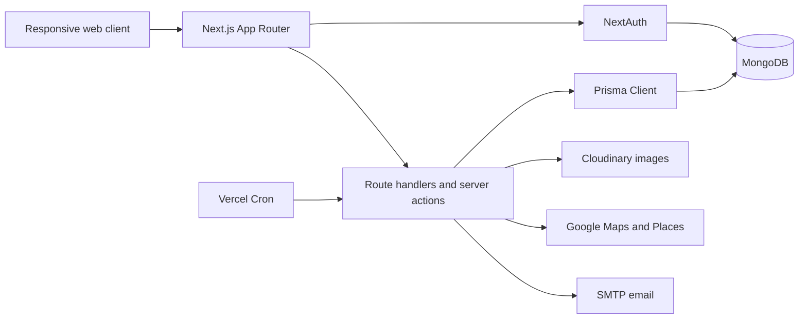

# Redrive

<div align="center">


**An Australian peer-to-peer marketplace for cars, utes, caravans, motorhomes, boats and other adventure vehicles.**

</div>

Redrive helps guests discover and request vehicles while giving owners the tools to list, manage and review bookings. The product combines an Australian state/suburb search experience with secure account onboarding, licence readiness, private listing locations, messaging, notifications and marketplace administration.

> The current application supports booking requests and price records. Real payment collection and host payouts are not yet connected to a payment provider.

## Contents

- [Product capabilities](#product-capabilities)
- [Architecture](#architecture)
- [Technology](#technology)
- [Repository statistics](#repository-statistics)
- [Getting started](#getting-started)
- [Environment variables](#environment-variables)
- [Database and security operations](#database-and-security-operations)
- [Project structure](#project-structure)
- [Scripts](#scripts)
- [Deployment](#deployment)
- [Current limitations and roadmap](#current-limitations-and-roadmap)

## Product capabilities

### Discovery and listings

- Ten active vehicle categories: cars, utes, bikes, caravans, motorhomes, boats, jet skis, yachts, vans and trucks.
- 59 selectable vehicle and adventure amenities.
- State, optional suburb, category, capacity, date and price search filters.
- Up to ten signed Cloudinary image uploads per listing.
- Favourites and locally tracked recently viewed listings.
- Responsive listing grids and image galleries.
- Google Places-assisted addresses and minimalist suburb-level maps.
- Public listing responses conceal exact addresses, coordinates and registration documents.

### Accounts and trust

- NextAuth credentials and Google OAuth sign-in.
- Multi-step signup with Australian mobile, date-of-birth and address validation.
- Six-digit SMTP email verification with a responsive Redrive email template.
- Optional email code after password sign-in.
- Single-use, hashed password-reset tokens and recovery pages.
- Front/back Australian driver-licence OCR classification, profile/expiry matching and booking-readiness checks.
- Private authenticated Cloudinary licence delivery using short-lived signed URLs.
- Account/IP rate limiting for authentication and sensitive actions.
- Administrator roles, protected admin routes and security audit events.

### Booking and trip operations

- Server-authoritative date and price calculation.
- Versioned booking quote snapshots with platform, service, protection and cleaning fees.
- Reservation and owner-block conflict detection.
- Host approval/decline state transitions.
- Retained cancellation records, cancellation reasons and refund estimates.
- Guest trips, host reservations and reservation-detail pages.
- Backend foundations for guided pickup/return reports and incident cases.
- Exact pickup location released only to the owner or after booking approval.

### Communication and administration

- Participant-only chat with paginated messages, unread state and typing presence.
- In-app notifications for bookings, messages, favourites, reviews and security events.
- Scheduled booking/review reminders and expired-notification cleanup.
- Protected admin dashboard with user, listing, booking and marketplace metrics.
- Protected licence-review and audit APIs.
- Help Centre, editorial articles, newsroom, policy and SEO routes.

## Architecture



The application deliberately uses one authentication and persistence stack: NextAuth 4, Prisma and MongoDB. Shared business logic lives under `app/libs` and `app/services`; route handlers authorize access before database operations.

## Technology

| Layer | Current implementation |
|---|---|
| Framework | Next.js 15.5 with App Router and React 19 |
| Language | TypeScript 5 |
| Styling | Tailwind CSS 3.4 and project design tokens |
| Authentication | NextAuth 4, Prisma adapter, Google OAuth, credentials and email OTP |
| Database | MongoDB through Prisma 6.12 |
| Images | Authenticated server-side Cloudinary uploads |
| Maps | Google Maps JavaScript API, Places API and privacy-safe suburb geocoding |
| Email | Nodemailer-compatible SMTP |
| Client state | Zustand, React Hook Form and focused custom hooks |
| Monitoring | Vercel Analytics and Speed Insights |
| Deployment | Vercel with protected scheduled jobs |

## Repository statistics

Measured on **17 August 2026** from the current working tree. Line counts cover `.ts`, `.tsx`, `.js`, `.jsx`, `.css`, `.prisma` and `.ps1` files under `app`, `pages`, `prisma` and `scripts`; dependencies and generated build output are excluded.

### Code size

| Extension | Files | Physical lines |
|---|---:|---:|
| TypeScript (`.ts`) | 80 | 6,135 |
| React TypeScript (`.tsx`) | 120 | 10,809 |
| JavaScript (`.js`) | 2 | 276 |
| CSS (`.css`) | 1 | 228 |
| Prisma (`.prisma`) | 1 | 451 |
| PowerShell (`.ps1`) | 2 | 35 |
| **Total** | **206** | **17,934** |

There are **15,948 non-blank lines** in the same measured source set. Physical and non-blank lines are descriptive repository measurements, not claims about complexity or developer productivity.

### Application inventory

| Item | Count |
|---|---:|
| App Router page files | 25 |
| API route files | 41 |
| Exported HTTP handlers | 59 |
| Components under `app/components` | 65 |
| Custom hooks | 11 |
| Server actions | 6 |
| Prisma models | 22 |
| Prisma enums | 1 |
| Active vehicle categories | 10 |
| Selectable amenities | 59 |
| Public assets | 10 |

The latest local production build generated **53 App Router routes** plus the NextAuth Pages Router API route. These figures will naturally change as features are added.

## Getting started

### Prerequisites

- Node.js 20 LTS or a compatible newer release.
- npm.
- MongoDB Atlas or another MongoDB deployment compatible with Prisma. A replica-set deployment is recommended because booking creation uses transactions.
- Cloudinary credentials for uploads.
- Google OAuth and Google Maps/Places credentials for the corresponding features.
- An SMTP account for production email verification and recovery.

### Install and run

```powershell
npm install
Copy-Item .env.example .env.local
npx prisma generate
npm run dev
```

Open [http://localhost:3000](http://localhost:3000).

Before applying the schema to an existing database, take a backup and confirm which environment `DATABASE_URL` targets:

```powershell
npx prisma validate
npx prisma db push
```

Run `prisma db push` against staging first. MongoDB projects do not use Prisma SQL migration files; `db push` creates the collections/indexes represented by [`prisma/schema.prisma`](prisma/schema.prisma).

## Environment variables

Copy [`.env.example`](.env.example) and supply real values locally and in the deployment environment.

| Variable | Required | Purpose |
|---|---|---|
| `DATABASE_URL` | Yes | MongoDB connection string |
| `NEXTAUTH_SECRET` | Yes | Signs NextAuth session tokens |
| `NEXTAUTH_URL` | Production | Canonical URL used by authentication and email links/assets |
| `NEXT_PUBLIC_SITE_URL` | Production | Canonical public origin for links and payment returns |
| `RATE_LIMIT_SECRET` | Yes | HMAC key for privacy-preserving rate-limit identifiers |
| `SESSION_IDLE_TIMEOUT_MINUTES` | Recommended | Web and native inactivity timeout; defaults to 60 minutes |
| `MOBILE_TOKEN_ISSUER`, `MOBILE_TOKEN_AUDIENCE` | Mobile API rollout | Issuer and audience restrictions for mobile access tokens |
| `MOBILE_ACCESS_TOKEN_KEY_ID`, `MOBILE_ACCESS_TOKEN_PRIVATE_KEY`, `MOBILE_ACCESS_TOKEN_PUBLIC_KEYS` | Mobile API rollout | Active key ID and independently rotatable asymmetric mobile signing keys |
| `MOBILE_REFRESH_TOKEN_PEPPER` | Mobile API rollout | Independent server-only refresh-token hashing secret |
| `EXPO_ACCESS_TOKEN` | Authenticated push | Server-only Expo push credential |
| `ADMIN_EMAILS` | Recommended | Comma-separated administrator allow-list |
| `GOOGLE_CLIENT_ID`, `GOOGLE_CLIENT_SECRET` | For Google login | Google OAuth application |
| `SMTP_HOST`, `SMTP_PORT`, `SMTP_SECURE` | Production email | SMTP transport configuration |
| `SMTP_USER`, `SMTP_PASS`, `EMAIL_FROM` | Production email | SMTP credentials and sender identity |
| `NEXT_PUBLIC_GOOGLE_MAPS_API_KEY` | Maps | Browser Maps API key |
| `GOOGLE_PLACES_API_KEY` | Address search | Server-side Places key |
| `GOOGLE_CLOUD_VISION_API_KEY` | Licence checks | Server-side OCR for front/back Australian driver-licence images |
| `LICENSE_DATA_ENCRYPTION_KEY`, `LICENSE_DATA_HMAC_KEY` | Licence checks | Encrypts document numbers and creates keyed duplicate-check hashes |
| `NEXT_PUBLIC_CLOUDINARY_CLOUD_NAME` | Uploads | Cloudinary cloud identifier |
| `CLOUDINARY_API_KEY`, `CLOUDINARY_API_SECRET` | Uploads | Server-only signed-upload credentials |
| `CRON_SECRET` | Production jobs | Protects scheduled notification and security tasks |
| `RESTORE_TEST_DATABASE_URL` | Restore drills only | Explicit disposable restore target |
| `ENABLE_LEGACY_API_AUTH` | No | Compatibility endpoint; keep `false` unless documented |
| `EXPO_PUBLIC_*` mobile values | Mobile builds | Public EAS-scoped API, Stripe, monitoring, and map configuration |

Never commit `.env`, `.env.local`, database URLs, signing keys, refresh-token peppers, SMTP passwords or Cloudinary secrets. The complete walkthrough is in [`ENVIRONMENT_VARIABLES_GUIDE.md`](ENVIRONMENT_VARIABLES_GUIDE.md); session expiry is described in [`guides/session-timeouts.md`](guides/session-timeouts.md); the rate-limit and cache design is in [`guides/cache-and-rate-limiting.md`](guides/cache-and-rate-limiting.md); mobile architecture and provisioning gates are recorded in [`MOBILE_FOUNDATION_CHECKLIST.md`](MOBILE_FOUNDATION_CHECKLIST.md).

### Email verification behavior

Password registrations receive a personalised six-digit code through SMTP. Codes and login OTPs expire after ten minutes and are stored only as hashes. Password-reset links are single-use and short-lived.

When SMTP is intentionally blank during local development, the code is logged by the server and returned to the development verification UI. Production fails closed when delivery is not configured. The email hero and application links use `NEXTAUTH_URL`, so it must be a publicly reachable deployment URL in production.

## Database and security operations

### Main data groups

- Identity: `User`, `Account`, `UserSession`, `WebAuthnCredential`, `PasswordResetToken`.
- Marketplace: `Listing`, `Reservation`, `BookingQuote`, `AvailabilityBlock`.
- Trip safety: `HandoverReport`, `HandoverMedia`, `IncidentCase`, `MaintenanceRecord`.
- Communication: `Chat`, `Message`, `Notification`, `Review`.
- Operations: `AuditEvent`, `RateLimitBucket`, `FeatureFlag`, `SavedSearch`, `Badge`.

### Security controls

- Authentication and ownership checks on protected data-changing routes.
- Account and IP rate-limit buckets with hashed identifiers.
- Signed uploads with a 10 MB limit, extension/MIME/signature allow-lists and full image decode/re-encoding.
- Authenticated licence assets and short-lived delivery URLs.
- Server-calculated booking totals and controlled status transitions.
- Security headers including CSP, HSTS, frame denial and MIME-sniffing prevention.
- Audit events for sensitive account, booking and administrator activity.
- Daily cleanup of expired security records and licence-expiry processing.

See [`SECURITY_FEATURE_IMPLEMENTATION_REPORT.md`](SECURITY_FEATURE_IMPLEMENTATION_REPORT.md) for implementation details and production caveats.

### Backup and restore drill

The repository includes guarded PowerShell operations scripts:

```powershell
./scripts/backup-mongodb.ps1
./scripts/restore-drill-mongodb.ps1 -Archive ./backups/redrive-YYYYMMDD-HHMMSS.archive.gz
```

The backup script produces a compressed archive and SHA-256 checksum. The restore script refuses targets unless `RESTORE_TEST_DATABASE_URL` clearly identifies a restore, drill, staging or test database. Do not point restore drills at production.

## Project structure

```text
redrive/
├── app/
│   ├── actions/                 # Server-side data queries
│   ├── admin/                   # Protected administration UI
│   ├── api/                     # App Router route handlers
│   ├── components/              # Shared UI components
│   ├── content/                 # Editorial, Help Centre and newsroom content
│   ├── hooks/                   # Client hooks and state coordination
│   ├── libs/                    # Auth, validation, pricing and security helpers
│   ├── services/                # Notification and business services
│   └── */page.tsx               # Product routes
├── pages/api/auth/              # NextAuth handler
├── prisma/schema.prisma         # MongoDB data model and indexes
├── public/                      # Static images and email artwork
├── scripts/                     # Analysis, backup and restore tooling
├── middleware.ts                # Protected-route middleware
├── next.config.js               # Images, performance and security headers
├── vercel.json                  # Scheduled production jobs
└── .env.example                 # Environment contract
```

## Scripts

| Command | Purpose |
|---|---|
| `npm run dev` | Start the local Next.js development server |
| `npm run build` | Generate Prisma Client and create a production build |
| `npm run start` | Serve the completed production build |
| `npm run lint` | Run the configured Next.js lint command |
| `npm run analyze` | Build with bundle analysis enabled |
| `npm run analyze-performance` | Run the local bundle analysis helper |
| `npx prisma validate` | Validate the Prisma schema |
| `npx prisma generate` | Regenerate Prisma Client |

The standard pre-deployment checks are:

```powershell
npm audit --audit-level=low
npx prisma validate
npm run build
git diff --check
```

## Deployment

Redrive is configured for Vercel:

1. Import the repository into Vercel.
2. Add every required value from `.env.example` to the correct environment.
3. Set `NEXTAUTH_URL` to the production origin.
4. Apply the Prisma schema to staging and then production intentionally.
5. Confirm Google OAuth redirect URLs and API restrictions.
6. Confirm Cloudinary signed uploads and SMTP delivery.
7. Set `CRON_SECRET`; Vercel invokes the notification job daily at 09:00 UTC and security maintenance at 02:15 UTC.
8. Run the production build and smoke-test with separate guest, host and administrator accounts.

## Current limitations and roadmap

The following items should not be described as production-complete:

- Marketplace payment collection, deposits, refunds and host payouts require a provider such as Stripe Connect plus Australian business/legal decisions.
- Passkey and trusted-device database foundations exist, but complete browser ceremonies and session-management UI remain future work.
- Guided handover and incident data APIs exist; their complete guest/host visual workflows are still being developed.
- Smart recommendations currently include demonstration data and should be connected entirely to database records before production promotion.
- The app has accessibility-conscious components, but it has not received a complete independent WCAG 2.2 certification.
- Offline PWA support, route/range planning, fleet tools and advanced pricing suggestions remain roadmap items.

See [`new_feature.md`](new_feature.md) for prioritised product opportunities and their implementation status.

## Business model direction

Potential revenue sources include booking platform fees, optional protection partnerships, promoted listings and verification services. These are product directions, not a statement that each revenue stream is currently live.

## License

This repository is licensed under the terms in [`LICENSE.md`](LICENSE.md).

---

<div align="center">

**Built with TypeScript, Next.js and a focus on trusted Australian adventures.**

</div>
