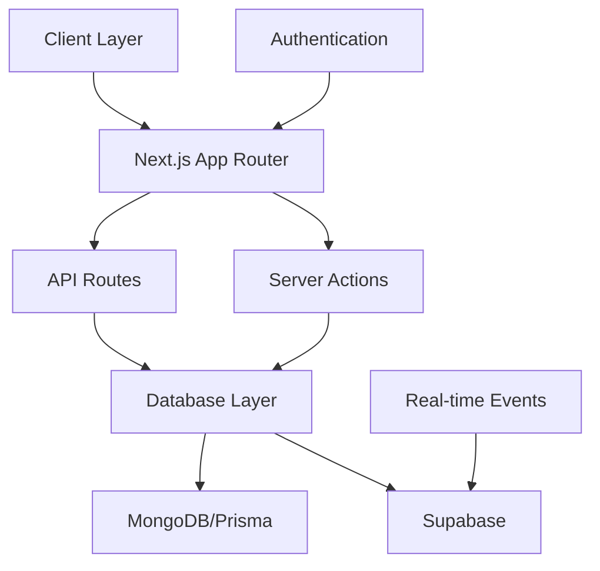

# 🚀 REDRIVE - Modern Vehicle Rental Platform

> A Solo Developer's Triumph: 60+ Days, 320+ Hours of Development
>
> Built with Next.js 14, TypeScript, and an unshakable passion for coding ❤️

<div align="center">


**40+ Days of Development | 220+ Hours of Coding | Countless Debugging Sessions**

</div>

## 🏆 Project Journey & Architecture

This MVP represents more than just code—it's a testament to perseverance, problem-solving, and the power of determination. Built from the ground up by a single developer, REDRIVE showcases what's possible with modern web technologies and relentless dedication.

### Development Milestones

- ✔️ 60+ Days of Non-Stop Development
- ✔️ 320+ Hours of Coding & Debugging
- ✔️ Mastered Next.js, Prisma, MongoDB Stack
- ✔️ Implemented Real-Time Features
- ✔️ Developed Complex Booking System

### System Architecture



## 🛠 Technical Stack

| Category  | Technologies                  | Implementation Details               |
| --------- | ----------------------------- | ------------------------------------ |
| Frontend  | Next.js 14, React, TypeScript | Server Components, App Router        |
| Styling   | TailwindCSS                   | Custom Components, Responsive Design |
| Backend   | Next.js API Routes            | RESTful Architecture, Server Actions |
| Database  | MongoDB, Prisma ORM           | Type-safe Queries, Relations         |
| Real-time | Supabase                      | WebSocket, Real-time Updates         |
| Auth      | NextAuth.js                   | Multi-provider, JWT Sessions         |
| Storage   | Cloudinary                    | Image Optimization, CDN              |
| Maps      | Google Maps API               | Location Services                    |

## 💎 Core Features & Implementation

### Authentication System

```typescript
interface AuthSystem {
  providers: ["Google", "GitHub", "Email"];
  security: {
    jwt: true;
    sessionManagement: true;
    roleBasedAccess: true;
  };
}
```

- Secure multi-provider authentication
- JWT token management
- Persistent sessions

### Advanced Listing Management

- CRUD operations with real-time updates
- Multi-image upload system
- Dynamic category filtering
- Geolocation integration

### Smart Reservation System

- Real-time availability checks
- Conflict prevention
- Dynamic pricing
- Automated notifications

### Review & Rating Platform

- Post-booking review system
- Rich text support
- Mobile-optimized UI
- Rating analytics

## 📱 Mobile-First Approach

- Responsive grid layouts
- Touch-friendly interfaces
- Swipeable components
- Adaptive navigation

## 🔄 State Management & Performance

### Custom React Hooks

```typescript
const useListings = () => {
  // Optimized listing management
};

const useReservations = () => {
  // Real-time booking handling
};
```

### Performance Optimizations

- Server-side rendering
- Image optimization
- Code splitting
- Caching strategies

## 🚀 Deployment & Infrastructure

- Vercel deployment
- Environment configuration
- CI/CD pipeline
- Monitoring setup

## 🎯 Future Roadmap

| Feature             | Status    | Priority |
| ------------------- | --------- | -------- |
| Payment Integration | Planning  | High     |
| AI Recommendations  | Research  | Medium   |
| Chat System         | In Design | High     |
| Analytics Dashboard | Planning  | Medium   |
| Mobile App          | Future    | Low      |

## 💡 Development Challenges Conquered

- 🛠 Complex Database Relations
- 🔄 Real-time State Management
- 📡 API Architecture Design
- 💾 Data Integrity & Security
- 🚀 Performance Optimization

## 🌟 Special Acknowledgment

Special thanks to Hiral, my partner and biggest supporter throughout this journey. Her encouragement and support were instrumental in bringing this project to life. ❤️

## 🤝 Contributing

1. Fork the repository
2. Create feature branch
3. Commit changes
4. Push to branch
5. Open pull request

## 📄 License

MIT License - see LICENSE.md

---

<div align="center">

**Built with TypeScript, Next.js, and ❤️**

_"From sleepless nights to working features, every line of code tells a story of persistence."_

[Documentation](docs) · [Report Bug](issues) · [Request Feature](issues)

</div>
