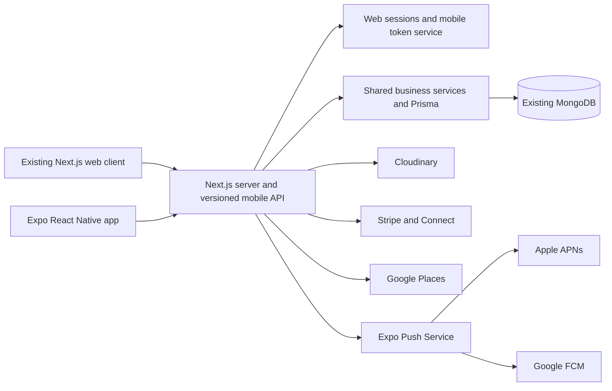

# Redrive Android and iOS App: Reliable Implementation Plan

**Document status:** Recommended implementation plan  
**Prepared for:** the current Redrive repository  
**Last validated:** 19 August 2026  
**Target platforms:** Android and iOS

**Step-by-step companion guide:** [`EXPO_REACT_NATIVE_DEVELOPMENT_AND_STORE_GUIDE.md`](./EXPO_REACT_NATIVE_DEVELOPMENT_AND_STORE_GUIDE.md)

## Executive decision

Build a real mobile client with **React Native, Expo, Expo Router, and TypeScript**, while keeping the existing **Next.js application as the backend and web client**.

The mobile app should live in this repository under `apps/mobile` and call versioned HTTPS endpoints such as `/api/mobile/v1/*`. It should use the same MongoDB database, Prisma models, Cloudinary account, Stripe account, email service, and server-side business rules already used by the web app.

Do **not** make a WebView wrapper the production strategy. A wrapper can be useful as a short-lived internal prototype, but it creates fragile authentication, file-upload, navigation, and payment behavior. More importantly, Apple says an app should provide features, content, and UI beyond a repackaged website under [App Review Guideline 4.2](https://developer.apple.com/app-store/review/guidelines/#minimum-functionality). Redrive has enough product depth to justify a proper mobile experience.

The target architecture is:



This plan provides one product, one backend, and two user interfaces. It avoids duplicating booking, pricing, permission, or privacy logic inside the phone app.

## What already exists and can be reused

The repository is a strong base for a mobile app:

- Next.js 15.5, React 19, and TypeScript.
- MongoDB through Prisma, with users, listings, reservations, payments, messages, notifications, reviews, saved searches, handover records, and incident records.
- Responsive mobile web layouts and a five-item mobile navigation model: Explore, Favourites, Trips, Inbox, and Profile.
- Credentials login, Google OAuth, email verification, optional login OTP, and password reset.
- Server-authoritative booking quotes and reservation conflict checks.
- Stripe Checkout/Connect routes, payment records, refunds, transfers, and webhooks. Production configuration and end-to-end payment behavior still need staging verification.
- Cloudinary uploads and protected licence/handover media delivery.
- Google Places and maps.
- Participant-authorized chat, notifications, presence, and Server-Sent Events (SSE).
- Vercel deployment and scheduled maintenance routes.

The React web components cannot simply be imported into React Native because DOM elements, CSS, browser maps, and browser authentication differ from native components. The reusable parts are the backend, product behavior, validation rules, TypeScript types, copy, design tokens, and selected pure functions.

## Options considered

| Option | Delivery speed | User experience | Store risk | Long-term cost | Decision |
|---|---:|---:|---:|---:|---|
| Progressive Web App only | Fastest | Good for basic browsing | Not an App Store app | Low | Useful as an interim improvement only |
| Capacitor/WebView wrapper | Fast | Mostly the current website | Medium/high on iOS; native edge cases | Medium/high | Internal prototype only |
| Expo/React Native app using the existing backend | Moderate | Native and reliable | Lowest if policies are followed | Moderate | **Recommended** |
| Separate Swift and Kotlin apps | Slowest | Maximum platform control | Low | Highest | Not justified for the first release |

Expo is not a toy wrapper. It produces native Android and iOS applications, supports custom native modules, and can produce store-ready binaries with EAS Build. See Expo's [production build documentation](https://docs.expo.dev/build/setup/).

## Product scope for version 1

### Guest and renter experience

- Browse and filter listings without signing in.
- View listing images, approximate location, features, reviews, availability, and price details.
- Create an account; verify email; sign in; recover a password; sign out from the device.
- Save favourites and saved searches.
- Request a booking from a server-issued quote.
- Pay for an approved booking through Stripe.
- View trips, status, cancellation terms, pickup information when eligible, and handover steps.
- Message the owner and receive push notifications.
- Upload profile, licence, handover, and incident photos through native photo/camera controls.
- View and update the profile, privacy settings, and notification preferences.
- Initiate account deletion in the app.

### Owner experience

- View owned listings and reservation requests.
- Approve or decline bookings.
- Block availability dates.
- Message guests and receive time-sensitive notifications.
- Complete pickup and return handover reports.
- Open Stripe-hosted Connect onboarding and return to the app through a verified deep link.

Creating and heavily editing a vehicle listing can be included in version 1 if owner acquisition depends on it. Otherwise, defer the complex editor to version 1.1 and provide a clear, non-broken handoff to the website. The app must still have substantial native value without that editor.

### Explicitly out of scope for the first store release

- Native administration dashboard.
- Fully offline booking, chat, or payment.
- Background GPS tracking.
- Rebuilding MongoDB or Prisma in a separate mobile backend.
- Copying private server secrets into the app.

## Repository structure

Move toward a small npm workspace/monorepo without disrupting the deployed Next.js app:

```text
redrive/
├── app/                         # Existing Next.js web UI and server routes
├── pages/                       # Existing NextAuth handler
├── prisma/                      # Existing database schema
├── apps/
│   └── mobile/
│       ├── app/                 # Expo Router screens and layouts
│       ├── components/          # Native components
│       ├── features/            # Auth, listings, trips, chat, profile
│       ├── services/            # API, secure session, push, deep links
│       ├── assets/              # App icon, splash, store artwork sources
│       ├── app.config.ts
│       └── eas.json
└── packages/
    ├── contracts/               # API request/response schemas and types
    ├── domain/                  # Pure validation/calculation helpers only
    └── design-tokens/           # Colour, typography, spacing primitives
```

Prisma, Stripe secret-key operations, Cloudinary signing, SMTP, and all privileged code stay on the server. Only values intentionally prefixed/public for the mobile build may reach the app.

## Workstream 1: create a mobile-safe API and authentication system

This is the most important backend work. The current web app primarily relies on NextAuth cookies. Several routes accept a short-lived bearer JWT through `getCurrentUserEnhanced`, but the existing `/api/auth/login` endpoint is explicitly a disabled legacy/test compatibility path. It has no refresh-token lifecycle and must **not** be enabled as the production mobile login system. Several protected routes still accept web sessions only.

### Required mobile authentication design

Add dedicated endpoints:

```text
POST   /api/mobile/v1/auth/register
POST   /api/mobile/v1/auth/verify-email
POST   /api/mobile/v1/auth/login
POST   /api/mobile/v1/auth/login/verify-otp
POST   /api/mobile/v1/auth/refresh
POST   /api/mobile/v1/auth/logout
POST   /api/mobile/v1/auth/logout-all
POST   /api/mobile/v1/auth/forgot-password
POST   /api/mobile/v1/auth/reset-password
GET    /api/mobile/v1/me
DELETE /api/mobile/v1/me
```

Use this session model:

- Access token: signed, audience-restricted, approximately 10 minutes, sent as `Authorization: Bearer <token>`.
- Refresh token: opaque, cryptographically random, approximately 30 days, rotated on every use.
- Store only a hash of each refresh token in MongoDB, with device/session ID, creation, last-use, and expiry fields.
- Detect refresh-token reuse; revoke that token family and require sign-in again.
- Keep the refresh token in `expo-secure-store`; keep the access token in memory where practical. Expo describes SecureStore as encrypted local key-value storage suitable for small secrets in its [SecureStore documentation](https://docs.expo.dev/versions/latest/sdk/securestore/).
- Revoke the device session on logout; revoke all sessions after password changes or “log out all devices.”
- Apply the existing account/IP rate limits, email verification, OTP checks, audit logging, and generic credential errors.
- Never use `NEXTAUTH_SECRET` as a general-purpose forever key. Add separately rotatable mobile signing keys with key IDs and a documented rotation procedure.

Refactor protected API routes through one authorization helper that supports either the existing web session or the new mobile access token. Authorization must still check ownership/participation for every object; possession of a valid token is not enough.

### Social sign-in decision

For the first review build, credentials plus email verification are sufficient and keep the scope controlled. If Google sign-in is exposed in the iOS app, also implement Sign in with Apple unless an App Review exception clearly applies. Apple states this requirement in [Guideline 4.8](https://developer.apple.com/app-store/review/guidelines/#login-services). Provider identity tokens must be verified by the Redrive server and exchanged for a Redrive mobile session; third-party provider tokens are not Redrive API tokens.

### API contract rules

- Prefix mobile endpoints with `/api/mobile/v1` and do not break an installed app when web routes change.
- Define request and response schemas in `packages/contracts`; validate on the server at runtime.
- Return a consistent error envelope containing a stable machine code, safe message, request ID, and field errors when applicable.
- Use cursor pagination for listings, messages, notifications, and reviews.
- Use idempotency keys for booking creation, payment setup, upload finalization, and status actions that might be retried on poor networks.
- Server time, prices, fees, availability, permissions, and booking status remain authoritative.
- Add an OpenAPI document or equivalent executable contract and test it in CI.

## Workstream 2: build the native application

Use the current stable Expo SDK selected at project creation time, Expo Router, strict TypeScript, and development builds rather than depending on Expo Go for native capabilities. Expo Router supports protected navigation based on session state; see [Expo's authentication guide](https://docs.expo.dev/router/advanced/authentication/).

Suggested client foundations:

- Expo Router for stacks, tabs, modals, and deep links.
- TanStack Query for server cache, retries, cancellation, and invalidation.
- React Hook Form plus shared schemas for forms.
- `expo-secure-store` for refresh credentials.
- `expo-image-picker`/camera for user-selected images without broad photo-library access.
- Native maps with privacy-safe listing coordinates and the existing server-side Places proxy.
- `expo-notifications` for push registration and handling.
- Sentry or another approved crash reporter, with personal information scrubbed.
- Accessibility labels, dynamic text, sufficient touch targets, and screen-reader testing from the first component.

### Screen order

1. App shell, theme, tabs, error boundary, update screen, and API client.
2. Explore, search/filter, listing details, images, map, and reviews.
3. Registration, verification, login, OTP, reset, session refresh, and profile.
4. Favourites, saved searches, booking quote, request, trips, and reservation detail.
5. Inbox, chat, unread state, presence/typing where valuable, and push deep links.
6. Owner reservations, availability, payouts handoff, and handover/incident media.
7. Settings, privacy, account deletion, diagnostics, and legal screens.

### Network and offline behavior

- Cache public listing pages and the latest trips/inbox summaries for read-only display.
- Show when cached data was last refreshed.
- Queue only operations proven safe and idempotent, such as marking a notification read.
- Do not queue bookings, approvals, cancellations, payment confirmation, or handover agreement while offline.
- Use bounded retries with exponential backoff and do not retry most `4xx` responses.
- Make empty, loading, offline, expired-session, server-error, and maintenance states explicit.

## Workstream 3: payments, maps, uploads, chat, and notifications

### Payments

Vehicle rental is a physical service used outside the app. Apple requires a payment method other than In-App Purchase for that category in [Guideline 3.1.3(e)](https://developer.apple.com/app-store/review/guidelines/#goods-and-services), and Google Play says Play Billing must not be used for physical goods/services in its [Payments policy](https://support.google.com/googleplay/android-developer/answer/9858738?hl=en-GB). Stripe is therefore appropriate for Redrive's rental payments.

Preferred mobile flow:

- Keep quote and total calculation on the Redrive server.
- Add a server endpoint that creates or retrieves the payment object idempotently.
- Present Stripe's native React Native PaymentSheet and support Apple Pay/Google Pay when the merchant configuration is ready. Stripe recommends PaymentSheet for most mobile apps in its [mobile payment documentation](https://docs.stripe.com/payments/mobile/payment-sheet).
- Treat the Stripe webhook—not the phone—as the source of truth for paid status.
- Route delayed/cancelled/failed returns back into reservation detail and refetch status.
- Continue hosted Stripe Connect onboarding for owners, opened in an authenticated system browser session with a verified return link.

### Maps and location

- Default to search by state/suburb and manual address entry; do not require location permission to browse.
- Ask for foreground location only after the user chooses “Use my location,” with a purpose-specific explanation.
- Never expose exact owner coordinates before the existing release condition is met.
- Keep Google API keys restricted by iOS bundle ID, Android package/signing certificate, API, and server IP/domain as applicable.

### Images and sensitive documents

- Use native image selection/camera, compress large images, strip unnecessary metadata, and upload with authenticated multipart requests or short-lived signed upload grants.
- Preserve the existing MIME, size, signature, ownership, and authorization checks on the server.
- Never place licence images in a public bucket or cache. Deliver short-lived authorized URLs and avoid retaining them in general image caches.
- Include upload progress, cancellation, retry, and recovery after app suspension.

### Chat and notifications

The existing SSE implementation can remain for the web client. For mobile foreground chat, either add bearer-token support and reconnection cursors to a tested SSE client or use short polling initially. Do not assume a long-running connection remains alive when a mobile app is backgrounded.

Background updates should use push notifications. Expo provides a unified layer over APNs and FCM, described in its [push overview](https://docs.expo.dev/push-notifications/overview/). Store one or more device push tokens per user, remove invalid tokens from push receipts, and make every notification a hint to refetch authorized data rather than a container for sensitive information.

Push events for version 1 should include:

- New message.
- Booking requested, approved, declined, cancelled, or payment due.
- Upcoming pickup/return reminder.
- Review reminder.
- Security alert.

Every notification must deep-link to an authorized screen and behave safely when signed out or signed into a different account.

## Workstream 4: deep links and web continuity

Configure both:

- HTTPS Universal Links/App Links, such as `https://redrive.example/trips/<id>`.
- A private app scheme used only where a provider requires one, such as `redrive://stripe-redirect`.

HTTPS links should open the app when installed and the existing web page otherwise. Publish the Apple association file and Android asset links file from the production domain. Validate link ownership in release builds, not only simulators.

Email verification, password reset, Stripe return, listing share, trip, chat, and notification URLs need explicit routing tests for:

- App installed and signed in.
- App installed and signed out.
- App not installed.
- Wrong Redrive account.
- Expired or already-used link.

## Security and privacy release gate

Use the [OWASP Mobile Application Security Verification Standard](https://mas.owasp.org/MASVS/) as the mobile security checklist. At minimum:

- No database, SMTP, Stripe secret, Cloudinary secret, server Maps key, JWT signing key, or cron secret in the app bundle or EAS public variables.
- TLS only; reject clear-text network traffic.
- Short-lived, audience-scoped access tokens and rotated refresh tokens.
- Server-side ownership checks on every protected record and media object.
- Rate limits and audit events for login, reset, licence, booking, payment, deletion, and session changes.
- Redaction of tokens, addresses, licence data, message bodies, and payment identifiers from analytics and crash logs.
- Dependency, secret, static-analysis, API authorization, and mobile binary checks before release.
- A tested lost-device/logout-all flow and signing-key rotation runbook.
- A privacy policy and data inventory that accurately describe MongoDB, Cloudinary, Google, Stripe, SMTP, Expo push, and monitoring data flows.
- Data retention/deletion behavior agreed with legal/accounting requirements before implementation; reservations and financial records may require lawful retention or de-identification rather than immediate erasure.

This is product and engineering guidance, not legal advice. Australian privacy, consumer, insurance, identity-document, vehicle-rental, and tax obligations should be reviewed by qualified advisers before public launch.

## Store requirements that must be designed in, not added at the end

### Both stores

- Publicly reachable privacy policy and support/contact pages.
- Accurate data collection, tracking, deletion, and permission declarations.
- App icon, screenshots, description, category, age rating, and reviewer instructions.
- A stable staging/review account with representative content and any required OTP instructions.
- No placeholder screens, broken URLs, hidden unfinished purchase flows, or production secrets in reviewer notes.
- In-app account deletion plus appropriate confirmation and reauthentication.

Apple requires apps that support account creation to let users initiate account deletion in the app; see [Apple's account deletion guidance](https://developer.apple.com/support/offering-account-deletion-in-your-app/). Google requires an in-app deletion path **and** a public web deletion-request link; see [Google Play's account deletion requirements](https://support.google.com/googleplay/android-developer/answer/13327111?hl=en).

### Apple-specific

- Enrol as the entity that should appear as the seller. An organization needs legal entity status, authority, a business-domain email/website, and a D-U-N-S number; see [Apple enrollment requirements](https://developer.apple.com/help/account/membership/program-enrollment).
- Add Sign in with Apple if Google/social login is offered and no exception applies.
- Give App Review a functioning account and explain the physical vehicle-rental payment model.
- Provide complete privacy labels and required-purpose strings for camera, photos, location, notifications, and Face ID if used.
- Demonstrate native value: push alerts, native camera/photo workflows, secure local sessions, deep links, native navigation, and reliable trip/handover tools.

### Google-specific

- Use an organization developer account for the operating business where appropriate and complete identity verification.
- Complete the Data safety, account deletion, content rating, ads, and app access declarations accurately.
- Maintain the target API level required at the time of every release. Google currently requires new apps and updates to target an API level within one year of the latest major Android version; see the current [target API policy](https://support.google.com/googleplay/android-developer/answer/16561298?hl=en).
- New personal developer accounts have additional testing and device-verification requirements, described in [Play Console setup](https://support.google.com/googleplay/android-developer/answer/6112435?hl=en). An organization account avoids treating a commercial product as a personal project, but still has verification requirements.

## Testing strategy

### Automated tests

- Unit tests for contract validation, auth rotation/revocation, money/date display, booking rules, deep-link parsing, and permission state.
- API integration tests against a disposable test database for every mobile endpoint and both allowed/forbidden ownership cases.
- Contract tests proving the mobile client and `/api/mobile/v1` agree.
- React Native component tests for critical forms and state transitions.
- Maestro or Detox end-to-end tests for the golden paths on both platforms.
- Existing web regression tests to prove API refactors do not break browser sessions.

### Mandatory real-device matrix

- At least one supported older iPhone and one current iPhone.
- At least one lower/mid-range Android and one current Android.
- Wi-Fi, mobile data, slow/lost connection, background/foreground, killed app, and expired session.
- Camera/photo permission granted, denied, limited, and later revoked.
- Notification permission granted and denied.
- Fresh install, upgrade, logout/login, password change, and app restored from backup.
- Stripe test cards and redirect methods, cancelled checkout, delayed webhook, duplicate taps, and app termination during payment.
- TestFlight and Google Play internal/closed tracks before production.

### Golden end-to-end release journeys

1. Browse without login → open listing → register → verify → return to the same listing.
2. Quote → booking request → owner approval → payment → trip detail.
3. Guest/owner message → push receipt → correct chat deep link.
4. Owner Connect onboarding → return to app → payout readiness refresh.
5. Pickup handover → protected photo upload → both-party agreement.
6. Password reset → all selected sessions revoked → sign in again.
7. Account deletion request → confirmation → expected retained/anonymized/deleted data.

No public release should proceed until these journeys pass on real Android and iOS devices against a staging environment with production-like integrations.

## Delivery phases and realistic estimate

The ranges below are planning estimates for **one experienced full-time engineer** with timely product decisions, usable designs, working third-party accounts, and no major redesign of booking or payment policy. They are not fixed quotes.

| Phase | Result | Estimate |
|---|---|---:|
| 0. Product and risk closure | Final scope, wireframes, data inventory, account/store readiness | 1–2 weeks |
| 1. Foundation and mobile API | Workspace, contracts, token auth, API normalization, CI, staging | 2–4 weeks |
| 2. Renter core | Explore, listing, auth, profile, favourites, quote, booking, trips | 4–6 weeks |
| 3. Communication and owner core | Chat, push, owner reservations, availability, deep links | 2–4 weeks |
| 4. Payments and handover | PaymentSheet/Connect returns, uploads, handover and incidents | 2–4 weeks |
| 5. Hardening and stores | Accessibility, performance, device QA, security, metadata, review | 2–4 weeks |
| **Likely first reliable release** | Android and iOS production candidates | **13–24 weeks** |

With two experienced engineers working in parallel after the API contracts are stable, the schedule may compress to roughly 9–15 weeks. Store-account verification and App Review/Play review are external lead times and can extend the calendar even after binaries are ready.

Avoid promising a “complete app in a few days.” A demo can be created quickly; secure authentication, payments, device behavior, accessibility, privacy, real-device QA, and store approval are the real release work.

## Costs and accounts

Current official headline fees as of the validation date:

- Apple Developer Program: **USD 99 per membership year** or local equivalent, per [Apple's membership comparison](https://developer.apple.com/support/compare-memberships/).
- Google Play Console: **USD 25 one-time registration fee**, per [Google's setup guide](https://support.google.com/googleplay/android-developer/answer/6112435?hl=en).
- Expo EAS: a limited free tier exists; current paid plans and usage charges are listed on [Expo pricing](https://expo.dev/pricing). Choose based on build volume, update audience, and support needs rather than hard-coding a plan into the architecture.

Also budget for design, real test devices, monitoring, transactional email, Cloudinary, Maps/Places, MongoDB, Stripe processing, legal/privacy review, support operations, and optional professional security testing. These costs depend on usage and commercial agreements, so they should be calculated from current provider quotes before launch.

Because rentals are physical services, normal App Store/Play digital-goods commission should not be assumed for the vehicle-rental transaction. The final store declarations and payment implementation must still match the actual product sold.

## What Codex can implement independently

Codex can perform the engineering work in this repository, including:

- Create the Expo project and monorepo/workspace structure.
- Build the versioned mobile API, contract package, refresh-session model, authorization refactor, and migrations/schema updates.
- Build Android/iOS screens, navigation, forms, API state, secure token storage, deep links, push registration, uploads, maps, Stripe client integration, and accessibility behavior.
- Add unit, integration, contract, component, and end-to-end tests.
- Add EAS build profiles, environment separation, CI checks, store build configuration, and release documentation.
- Produce icon/splash requirements, store-copy drafts, privacy data inventory drafts, reviewer instructions, and submission checklists.
- Run local checks and Android emulators available in the development environment; prepare iOS builds through EAS when the owner's Apple account is connected.
- Diagnose review feedback and prepare corrected binaries.

Codex cannot independently provide or legally approve:

- Ownership of the Apple/Google/Expo/Stripe/Google Cloud accounts.
- Identity checks, D-U-N-S/legal-entity verification, tax/banking details, certificates or agreements that require the business owner.
- Acceptance of developer agreements or legally binding store submissions on the owner's behalf.
- Production secrets, APNs/FCM credentials, OAuth configuration, merchant IDs, or domain/DNS control unless the owner supplies access through approved secure mechanisms.
- Legal conclusions, insurance approval, privacy consent, final retention policy, or business rules that have not been decided.
- Final human testing of real-world pickup/return operations or the stores' approval decision.

In practical terms: **yes, Codex can build and test the codebase and prepare release candidates.** The owner must create/verify the business accounts, provide decisions and credentials securely, approve legal/business text, test on real devices, and authorize submission.

## Decisions needed before implementation starts

1. Confirm that Expo/React Native is accepted as the production approach.
2. Confirm the version 1 owner scope: reservation management only, or full listing creation/editing.
3. Decide whether version 1 uses email/password only or includes both Google and Apple sign-in.
4. Confirm the production domain and final Android package ID/iOS bundle ID. These become difficult to change after release. Suggested form: `au.com.redrive.app`, subject to domain/trademark ownership.
5. Confirm legal entity, store-account ownership, privacy-policy owner, support email, and account-deletion policy.
6. Confirm which current Stripe flows have passed staging and whether native PaymentSheet is required in version 1.
7. Confirm the minimum supported OS versions and whether tablet layouts are included.

## Definition of done for version 1

The mobile release is done only when:

- The versioned API and mobile app pass automated checks.
- Web authentication and core web journeys still pass regression testing.
- No critical/high security finding remains open.
- The golden journeys pass on the agreed real-device matrix.
- Payment and webhook reconciliation pass in Stripe test mode and the production configuration checklist is signed off.
- Deep links, push notifications, uploads, denied permissions, offline states, and token expiry are tested.
- Privacy policy, deletion path, support page, store declarations, screenshots, and reviewer access are complete.
- Signed builds are accepted in TestFlight and Google Play internal/closed testing.
- Crash/health monitoring, rollback, support, and incident ownership are documented.
- The business owner explicitly approves the production submission.

## Recommended first implementation slice

Start with a vertical proof—not a throwaway prototype:

1. Create `apps/mobile` with Expo Router, development/preview/production environments, and CI.
2. Add the refresh-session database model and the `/api/mobile/v1/auth/*` flow.
3. Build native login, session restore, Explore, and listing-detail screens.
4. Add one authenticated action (favourite) and one push deep link.
5. Prove it on one real Android and one real iPhone through internal builds.
6. Security-review the pattern before expanding it to bookings, chat, payments, and sensitive uploads.

That slice resolves the highest-risk architecture questions early and creates production-quality foundations for the remaining screens.
